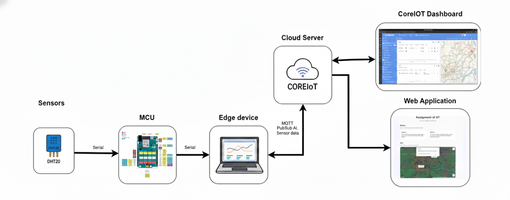

# AIOT Project
AIoT project is the ACLAB's entrance test. This project simulates an AIoT (AI + IoT) project.
<p align="center">
  
</p>

### Requirements
1) Implement a complete AIoT workflow as shown in the diagram.
2) Use the Yolo UNO board (ESP32-S3).
3) Use at least two peripherals (e.g., LCD, DHT20).
4) Integrate OTA updates, ESP-NOW, AI, and unit testing.

## Prerequisites
- VS Code with the PlatformIO IDE extension.
- 2x ESP32 boards: Receiver and Sender.
- CoreIoT account.
- Edge Impulse account (if you want to retrain model).

## Edge Impulse 
You can find my data for training AI store at `dataset` folder

## Firmware OTA
You can update firmware through USB port or using file .bin and update OTA (on ESP webserver)

## How to run
```bash
git clone https://github.com/NguyenHieu267/ACLAB.git 
cd ACLAB
git checkout IoT_project
```
Run Unit Tests
```bash
pio test
```
Build project
```bash
pio run
pio run --t upload --t monitor
```

#### This code is used for running on Receiver ESP32
```cpp
#include <Arduino.h>
#include <WiFi.h>
#include <esp_now.h>

#define LED_PIN 38 

typedef struct struct_message {
    bool led_state;
} struct_message;

struct_message myData;

//if ESP_ARDUINO_VERSION >= ESP_ARDUINO_VERSION_VAL(3, 0, 0). Change to below code:
//void OnDataRecv(const esp_now_recv_info *info, const uint8_t *incomingData, int len) {
void OnDataRecv(const uint8_t * mac, const uint8_t *incomingData, int len) {
    memcpy(&myData, incomingData, sizeof(myData));
    digitalWrite(LED_PIN, myData.led_state ? HIGH : LOW);
    
    Serial.printf("Received Command. LED turned: %s\n", myData.led_state ? "ON" : "OFF");
}

void setup() {
    Serial.begin(115200);
    pinMode(LED_PIN, OUTPUT);
    digitalWrite(LED_PIN, LOW);
    
    WiFi.mode(WIFI_STA);

    if (esp_now_init() != ESP_OK) {
        Serial.println("Error initializing");
        return;
    }
    
    esp_now_register_recv_cb(OnDataRecv);
    Serial.println("ESP32 Receiver Ready");
}

void loop() {
}
```